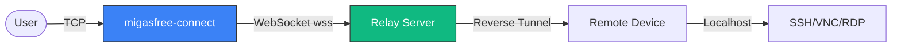

# Migasfree Connect

<div align="center">


</div>

Client for **migasfree remote tunnel sessions**. This tool allows you to connect to remote agents via SSH, VNC, or RDP through the Migasfree secure tunnel infrastructure.



## Features

- **Multi-protocol Support**: SSH, VNC, and RDP connections
- **Secure**: mTLS authentication with client certificates
- **WebSocket Tunneling**: Traverses firewalls and proxies
- **Cross-Platform**: Linux and Windows support
- **Auto-discovery**: Lists available agents from the Manager

## Requirements

- Python 3.8+
- `websockets`
- `requests`
- `urllib3`
- `openssl` (for certificate extraction)
- **Optional**: `migasfree-client` (for automatic server configuration)
- **Clients**:
  - SSH: `openssh-client`
  - VNC: `xtightvncviewer` (or similar)
  - RDP: `freerdp2-x11` (xfreerdp)

## Installation

### Debian/Ubuntu

```bash
sudo dpkg -i migasfree-connect_*.deb
sudo apt-get install -f  # To install dependencies
```

### RPM-based systems

```bash
sudo rpm -ivh migasfree-connect-*.rpm
```

### Windows (Installation)

#### Automatic Installation

Download the Windows package and run the installer as Administrator:

```cmd
cd migasfree-connect-1.0.0
install.bat
```

This will:

- Install Python dependencies
- Copy the script to `%PROGRAMDATA%\migasfree-connect`
- Add the installation directory to your PATH

#### Manual Installation

1. Install Python 3.8+ from [python.org](https://www.python.org/downloads/)
2. Install dependencies:

   ```cmd
   pip install requests websockets urllib3
   ```

3. Copy the script to a directory in your PATH

#### Windows Uninstallation

```cmd
uninstall.bat
```

### From Source (pip)

```bash
pip install .
```

### Development Installation

```bash
pip install -e ".[dev]"
```

## Setup

First time you run the tool, it will ask for a **Client Certificate** (.p12) to authenticate with the Migasfree Manager. Valid mTLS credentials (admin certificate) are required.

Certificates are stored in:

- **Linux**: `~/.migasfree-connect/<server>/`
- **Windows**: `%USERPROFILE%\.migasfree-connect\<server>\`

## Usage

```bash
migasfree-connect [USER] [OPTIONS]
```

### Examples

**SSH Connection:**

```bash
migasfree-connect -t ssh -a CID-4 -m https://<FQDN> root
```

**Execute Remote Command (SSH):**

```bash
migasfree-connect -t ssh -a CID-4 -m https://<FQDN> root -c "ls -la"
```

**VNC Connection:**

```bash
migasfree-connect -t vnc -a CID-4 -m https://<FQDN>
```

**RDP Connection:**

```bash
migasfree-connect -t rdp -a CID-4 -m https://<FQDN> tux
```

### Options

| Option          | Description                                      |
| --------------- | ------------------------------------------------ |
| `user`          | Remote username (required for SSH/RDP)           |
| `-t, --type`    | Service type: `ssh`, `vnc`, `rdp` (default: ssh) |
| `-a, --agent`   | Connect to a specific agent by ID                |
| `-m, --manager` | Migasfree Manager URL                            |
| `-p, --port`    | Local port to bind the tunnel (0 = automatic)    |
| `-c, --command` | Command to execute remotely (SSH only)           |

## Build

### Linux

To build DEB and RPM packages:

```bash
./build.sh [VERSION]
```

### Windows (Build)

To build a Windows distribution package:

```cmd
build.bat [VERSION]
```

This creates a ZIP file in `dist/` containing:

- `migasfree-connect` script
- `install.bat` and `uninstall.bat`
- Documentation

Packages are generated in `dist/`.

## Troubleshooting

- **Certificate Error**: Ensure your `.p12` file is valid and you have the correct password.
- **Connection Refused**: Check if the agent has the selected service (SSH/VNC/RDP) enabled and running.
- **No Agents**: Ensure you are connected to the correct Manager URL (`-m`).
- **SSH host key issues**: The tool automatically disables host key checking for localhost tunnels.
