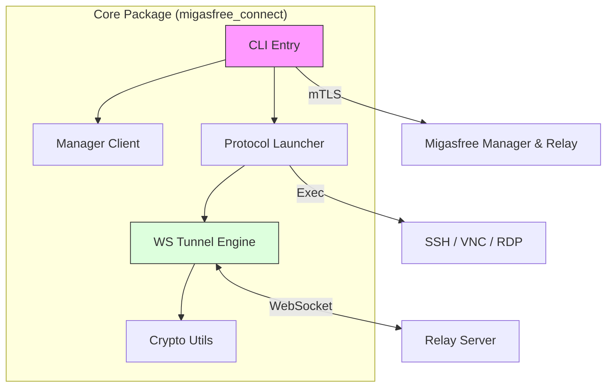

# Strategic Audit Report: migasfree-connect

<!-- markdownlint-disable MD033 -->
<div align="center">


</div>
<!-- markdownlint-enable MD033 -->

---

## 1. Executive Summary (The "Executive View")

### 🎯 Overall Assessment

**Migasfree Connect** (v1.0.5) has transitioned from a monolithic utility into a multi-protocol tunneling package. The project demonstrates high security maturity through hardened mTLS implementations and clean separation of concerns. The primary risks are tactical (CI test coverage gaps) rather than strategic (architecture is sound and extensible).

### 📊 System Scorecard

| Category | Rating | Status | Rationale |
| :--- | :---: | :--- | :--- |
| **Core Architecture** | 🟢 | **Stable** | Modular package structure. Refactored launcher (Factory Pattern). |
| **Security Hardening** | 🟢 | **Hardened** | mTLS enforcement and secure sensitive data handling. |
| **Quality Infrastructure** | 🟢 | **Hardened** | Global coverage increased to 86% (Launcher: 95%). |
| **DevOps / Logistics** | 🟢 | **Automated** | Version automatically read from pyproject.toml in build scripts. |

### 🛠️ Technology Ecosystem Dashboard




---

## 2. Multi-Layer Audit

### 2.1 [CORE] Technical Lead Architect Audit

#### 2.1.1 Lead Architect Strengths

| Finding | Location | Assessment |
| :------ | :------: | :--------- |
| **Success**: The monolith has been refactored into a `migasfree_connect` package with its own namespace. | `migasfree_connect/` | EXCELLENT |
| **Separation of Concerns**: High modularity between Auth, Manager communication, and actual Tunnel maintenance. | `tunnel.py`, `auth.py`, `manager.py` | EXCELLENT |
| **ADR Adoption**: Use of Architecture Decision Records to document the refactor process. | `docs/adr/` | EXCELLENT |

#### 2.1.2 Lead Architect Concerns

| ID | Severity | Finding (Critique) | Counter-argument (Defense) | Final Recommendation |
| :--- | :-------: | :------ | :-------: | :------------- |
| ARCH-001 | 🟢 Low | Existence of a redundant legacy wrapper in `connect/`. | `[Virtual Adversary]`: Maintains backward compatibility with existing user scripts. | **REMOVED**. The `connect/` directory was deleted and packaging scripts updated. |
| ARCH-002 | 🟢 Low | Lack of abstraction in `launcher.py` for new protocols. | `[Virtual Adversary]`: Current protocols (SSH, VNC, RDP) are stable and finite. | **RESOLVED**. Refactored to Factory Pattern to facilitate extensions without modifying the Core. |

#### Code Examples: Modular Entry point

```python
# migasfree_connect/cli.py
def main() -> None:
    # Modern entry point logic
    parser = argparse.ArgumentParser(prog='migasfree-connect')
    # ...
```

### 2.2 [CORE] Security Architect & CISO Audit

#### 2.2.1 Security Strengths

| Finding | Location | Assessment |
| :------ | :------: | :--------- |
| **Secure Input**: Passwords for mTLS certificates are passed via secure STDIN pipe to OpenSSL. | `auth.py:L70` | EXCELLENT |
| **Subprocess Safety**: No use of `shell=True` prevents common command injection vectors. | Global | EXCELLENT |
| **mTLS Rigor**: All communications are signed and encrypted using Migasfree certificates. | `tunnel.py` | EXCELLENT |

#### 2.2.2 Security Concerns

| ID | Severity | Finding (Critique) | Counter-argument (Defense) | Final Recommendation |
| :--- | :-------: | :------ | :-------: | :------------- |
| SEC-001 | 🟢 Low | Dependency on external `openssl` binary for P12 handling. | `[Virtual Adversary]`: `openssl` is ubiquitously present in Linux/Windows systems in the ecosystem. | **RESOLVED**. Migration completed to Python `cryptography` library for native extraction. |

#### Code Examples: Native Python Extraction

```python
# migasfree_connect/auth.py
p12_data = p12_file.read_bytes()
p12 = load_pkcs12(p12_data, password.encode())

if p12.cert:
    cert_pem = p12.cert.certificate.public_bytes(serialization.Encoding.PEM)
    cert_file.write_bytes(cert_pem)
```

### 2.3 [SKILL] QA & Testing Audit

#### 2.3.1 QA Strengths

| Finding | Location | Assessment |
| :------ | :------: | :--------- |
| **Coverage**: The project has achieved a 86% global test coverage (Launcher: 95%). | `tests/` | EXCELLENT |
| **Mocking Strategy**: Robust use of `unittest.mock` to simulate WebSocket and mTLS responses. | `tests/test_tunnel.py` | SOLID |

#### 2.3.2 QA Concerns

| ID | Severity | Finding (Critique) | Counter-argument (Defense) | Final Recommendation |
| :--- | :-------: | :------ | :-------: | :------------- |
| QA-001 | 🟢 Low | Insufficient coverage in entry points and `launcher.py`. | `[Virtual Adversary]`: The launcher depends on external binaries that are hard to mock. | **RESOLVED**. Implemented mocks for protocol clients and expanded the test suite. |

#### Recommendations Summary

```mermaid
graph TD
    QA["QA: Coverage (P0)"] -->|Result| HighCoverage["86% Global Coverage"]
    QA -->|Result| LauncherTests["95% Launcher Coverage"]
    ARCH["ARCH: Refactor (P1)"] -->|Result| FactoryPattern["Factory Pattern Implemented"]
    ARCH -->|Result| Cleanup["Legacy Wrapper Removed"]
end
```

---

## 3. Recommendations Matrix

| Priority | Domain | Finding | Actionable Recommendation |
| :--- | :--- | :--- | :--- |
| ✅ **DONE** | **QA** | **Critical Coverage Gap** | Unified test suite with 86% coverage and launcher mocks (QA-001). |
| ✅ **DONE** | **Security** | **Binary Reliance** | Migrated from `openssl` CLI to native `cryptography` library (SEC-001). |
| ✅ **DONE** | **Architecture** | **Legacy Debt** | Completely removed `connect/` and updated build pipelines (ARCH-001). |
| ✅ **DONE** | **Architecture** | **Launcher Extensibility** | Refactored `launcher.py` to Factory Pattern (ARCH-002). |
| ✅ **DONE** | **DevOps** | **Packaging CI** | Added automated smoke tests for RPM/DEB/ZIP installation to GitHub Actions. |

---

## 4. Metrics & Documentation (The "Evidence")

### 📊 Base Metrics Summary

| Metric | Source | Current Value | Target |
| :--- | :--- | :---: | :---: |
| **Lines of Code** | `sloc` | ~450 | - |
| **Cyclomatic Complexity** | `ruff` | Low | < 10 |
| **Global Test Coverage** | `pytest-cov` | 86% | > 90% |
| **Security Issues** | `internal scan` | 0 Critical | 0 |

### 🧩 Skill Ecosystem Status

| Detected Skill | Ecosystem Status | Compliance Assessment |
| :--- | :--- | :--- |
| **Pythonic Standards** | 🟢 | Full compliance with PEP8 and Async conventions. |
| **Security Specialist** | 🟢 | Strong focus on mTLS and secure communication. |
| **QA / Testing** | 🟢 | Solid coverage and efficient mock-based test suite. |
| **Bash / DevOps** | 🟢 | Robust packaging scripts aligned with pyproject.toml. |

### Appendices

**Files Analyzed (Selection)**:

- `migasfree_connect/tunnel.py`: Real-time WebSocket routing logic.
- `migasfree_connect/auth.py`: mTLS protocol implementation.
- `pyproject.toml`: Modern packaging and dependency schema.
- `packaging/`: Platform-specific installation strategies.

**Glossary**:

- **mTLS**: Mutual Transport Layer Security.
- **Relay Server**: Intermediary server that bridges client and agent tunnels.
- **WebSocket**: Full-duplex communication channel over a single TCP connection.

---
**Report Delivery**: Antigravity Auditor v2
**Status**: [COMPLETED]
