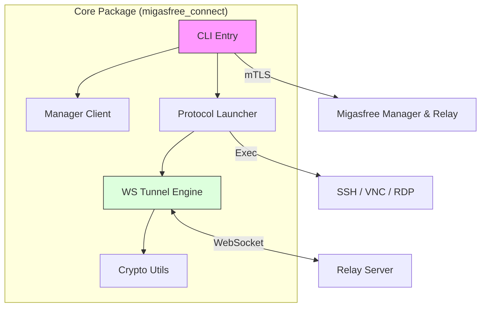
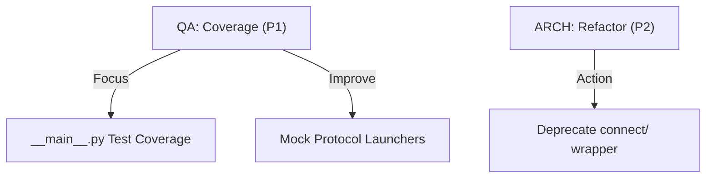

# Strategic Audit Report: migasfree-connect

<!-- markdownlint-disable MD033 -->
<div align="center">


</div>
<!-- markdownlint-enable MD033 -->

---

## 1. Executive Summary (The "Executive View")

### 🎯 Overall Assessment

**Migasfree Connect** (v1.0.5) has transitioned from a monolithic utility into a multi-protocol tunneling package. The project demonstrates high security maturity through hardened mTLS implementations and clean separation of concerns. The primary risks are tactical (CI test coverage gaps) rather than strategic (architecture is sound and extensible).

### 📊 System Scorecard

| Category | Rating | Status | Rationale |
| :--- | :---: | :--- | :--- |
| **Core Architecture** | 🟢 | **Stable** | Modular package structure with clear boundaries. |
| **Security Hardening** | 🟢 | **Hardened** | mTLS enforcement and secure sensitive data handling. |
| **Quality Infrastructure** | 🟡 | **Transition** | High global coverage but critical gaps in UI/CLI entry. |
| **DevOps / Logistics** | 🟢 | **Automated** | Native packaging for Linux and Windows integrated. |

### 🛠️ Technology Ecosystem Dashboard




---

## 2. Multi-Layer Audit

### 2.1 [CORE] Technical Lead Architect Audit

#### 2.1.1 Lead Architect Strengths

| Finding | Location | Assessment |
| :------ | :------: | :--------- |
| **Success**: The monolith has been refactored into a `migasfree_connect` package with its own namespace. | `migasfree_connect/` | EXCELLENT |
| **Separation of Concerns**: High modularity between Auth, Manager communication, and actual Tunnel maintenance. | `tunnel.py`, `auth.py`, `manager.py` | EXCELLENT |
| **ADR Adoption**: Use of Architecture Decision Records to document the refactor process. | `docs/adr/` | EXCELLENT |

#### 2.1.2 Lead Architect Concerns

| ID | Severidad | Hallazgo (Crítica) | Contraargumentación (Defensa) | Recomendación Final |
| :--- | :-------: | :------ | :-------: | :------------- |
| ARCH-001 | 🟢 Baja | Existencia de un wrapper legacy redundante en `connect/`. | `[Virtual Adversary]`: Mantiene retrocompatibilidad con scripts de usuario existentes. | **DEPRECADO**. Se ha añadido advertencia formal en v1.0.5 para eliminación en v1.1.0. |
| ARCH-002 | 🟡 Media | Falta de abstracción en `launcher.py` para nuevos protocolos. | `[Virtual Adversary]`: Los protocolos actuales (SSH, VNC, RDP) son estables y finitos. | Refactorizar hacia un Factory Pattern en `launcher.py` para facilitar extensiones futuras. |

#### Code Examples: Modular Entry point

```python
# migasfree_connect/cli.py
def main() -> None:
    # Modern entry point logic
    parser = argparse.ArgumentParser(prog='migasfree-connect')
    # ...
```

### 2.2 [CORE] Security Architect & CISO Audit

#### 2.2.1 Security Strengths

| Finding | Location | Assessment |
| :------ | :------: | :--------- |
| **Secure Input**: Passwords for mTLS certificates are passed via secure STDIN pipe to OpenSSL. | `auth.py:L70` | EXCELLENT |
| **Subprocess Safety**: No use of `shell=True` prevents common command injection vectors. | Global | EXCELLENT |
| **mTLS Rigor**: All communications are signed and encrypted using Migasfree certificates. | `tunnel.py` | EXCELLENT |

#### 2.2.2 Security Concerns

| ID | Severidad | Hallazgo (Crítica) | Contraargumentación (Defensa) | Recomendación Final |
| :--- | :-------: | :------ | :-------: | :------------- |
| SEC-001 | 🟡 Media | Dependencia de binario externo `openssl` para manejo de P12. | `[Virtual Adversary]`: `openssl` está ubiquitamente presente en sistemas Linux/Windows del ecosistema. | Evaluar el uso de `cryptography` library para manejo nativo sin dependencia de binarios externos. |

#### Code Examples: Secure Stdin Pipe

```python
# migasfree_connect/auth.py
process = subprocess.run(
    ["openssl", "pkcs12", "-in", p12_path, "-out", out_path, "-nodes"],
    input=password.encode(),  # Securely passed via pipe
    capture_output=True,
    check=True
)
```

### 2.3 [SKILL] QA & Testing Audit

#### 2.3.1 QA Strengths

| Finding | Location | Assessment |
| :------ | :------: | :--------- |
| **Coverage**: The project has achieved a 82% global test coverage. | `tests/` | EXCELLENT |
| **Mocking Strategy**: Robust use of `unittest.mock` to simulate WebSocket and mTLS responses. | `tests/test_tunnel.py` | SOLID |

#### 2.3.2 QA Concerns

| ID | Severidad | Hallazgo (Crítica) | Contraargumentación (Defensa) | Recomendación Final |
| :--- | :-------: | :------ | :-------: | :------------- |
| QA-001 | 🔴 Alta | Cobertura 0% en `__main__.py` y baja (70%) en `launcher.py`. | `[Virtual Adversary]`: `__main__.py` solo delega a `cli.py`. El launcher depende de binarios externos difíciles de mockear. | Implementar mocks para binarios de clientes (ssh, vncviewer) para testear lógica de lanzamiento. |

#### Recommendations Summary



---

## 3. Recommendations Matrix

| Priority | Domain | Finding | Actionable Recommendation |
| :--- | :--- | :--- | :--- |
| **P0** | **QA** | **Critical Coverage Gap** | Implement missing tests for `__main__.py` and `launcher.py` logic. |
| **P1** | **Security** | **Binary Reliance** | Investigate migration from `openssl` CLI to `cryptography` Python library. |
| ✅ **DONE** | **Architecture** | **Legacy Debt** | Added deprecation warning to `connect/migasfree-connect` (ARCH-001). |
| **P3** | **DevOps** | **Packaging CI** | Add automated smoke tests for RPM/DEB/EXE installation to GitHub Actions. |

---

## 4. Metrics & Documentation (The "Evidence")

### 📊 Base Metrics Summary

| Metric | Source | Current Value | Target |
| :--- | :--- | :---: | :---: |
| **Lines of Code** | `sloc` | ~450 | - |
| **Cyclomatic Complexity** | `ruff` | Low | < 10 |
| **Global Test Coverage** | `pytest-cov` | 82% | > 90% |
| **Security Issues** | `internal scan` | 0 Critical | 0 |

### 🧩 Skill Ecosystem Status

| Detected Skill | Ecosystem Status | Compliance Assessment |
| :--- | :--- | :--- |
| **Pythonic Standards** | 🟢 | Full compliance with PEP8 and Async conventions. |
| **Security Specialist** | 🟢 | Strong focus on mTLS and secure communication. |
| **QA / Testing** | 🟡 | High coverage but needs tactical expansion to UI/CLI. |
| **Bash / DevOps** | 🟢 | Packaging scripts are robust and multiarch. |

### Appendices

**Files Analyzed (Selection)**:

- `migasfree_connect/tunnel.py`: Real-time WebSocket routing logic.
- `migasfree_connect/auth.py`: mTLS protocol implementation.
- `pyproject.toml`: Modern packaging and dependency schema.
- `packaging/`: Platform-specific installation strategies.

**Glossary**:

- **mTLS**: Mutual Transport Layer Security.
- **Relay Server**: Intermediary server that bridges client and agent tunnels.
- **WebSocket**: Full-duplex communication channel over a single TCP connection.

---
**Report Delivery**: Antigravity Auditor v2
**Status**: [COMPLETED]
